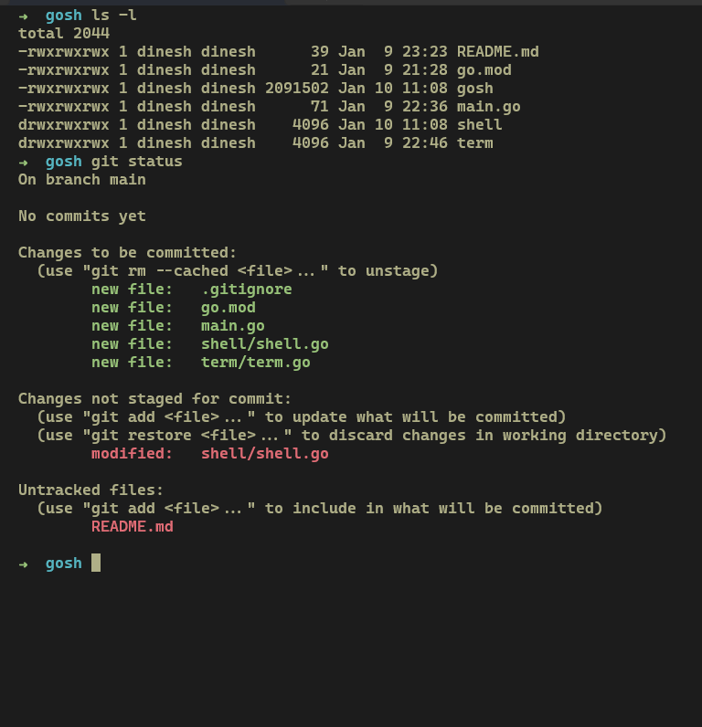

# Gosh - A simple shell in go

 Gosh is minimalistic shell written in Go, designed to provide lightweight and effcient command-line interface. It aims to be simple while offering essential shell functionalities.

 

# Getting Started

### Prerequisites

- Go installed on your system

### Installation

Clone the repository and build the gosh executable

```bash
git clone https://github.com/your-username/gosh.git
cd gosh
go build -o gosh
```
